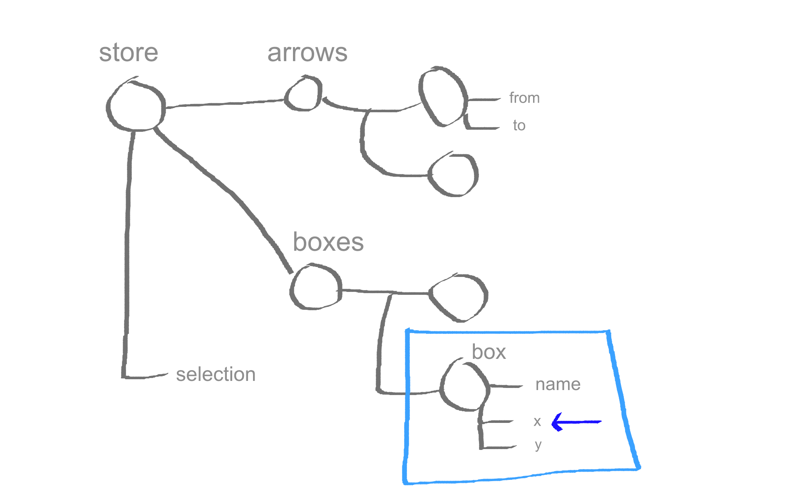
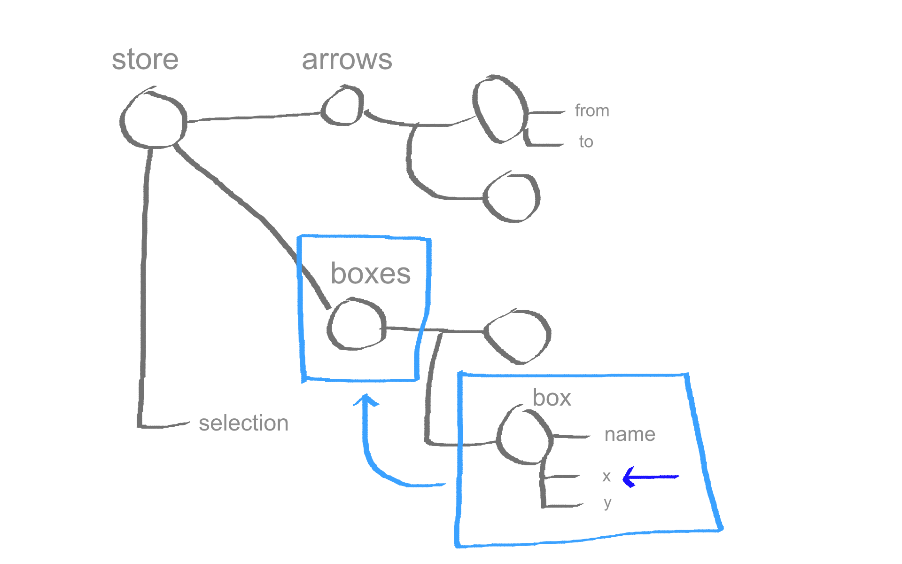
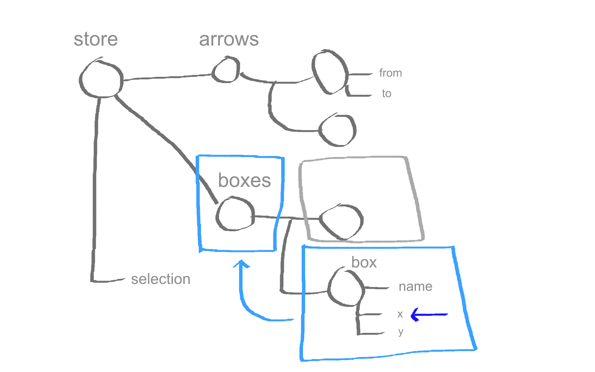
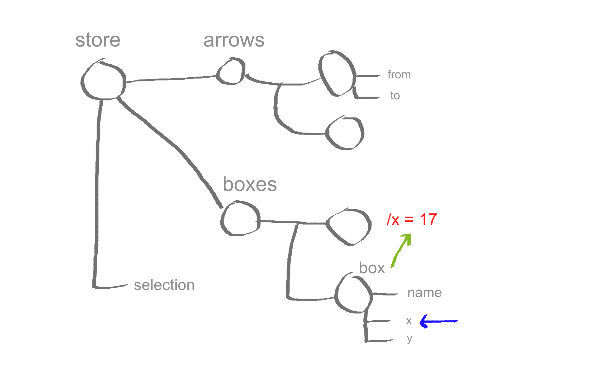
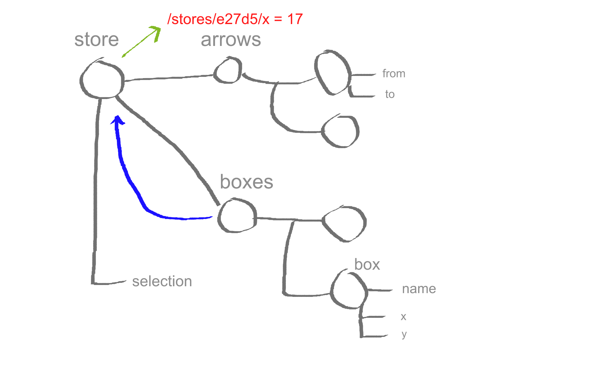

the basic problem we saw is that developers are too smart besides that they also too expensive so we have to make sure that they don't have to do stupid administrative tasks I mean everybody knows it if you have a developer orders a new keyboard and he has to fill out an excel form you get a net developer and so we should alternate things that's what we generally do when working in software so for example we stopped as a software engineering fields we still doing many Oh releases and instead figured that we should have declarative components describing how erdem should look like without doing the actual manipulations our shelf and so we figured that we should do the same for data flow we should use prospective pro-gay programming that's make sure that data is updated at the proper places so today I first we'll talk a bit about my bags and philosophy behind it and after that i will show how observable data is actually a more powerful methods an immutable data so Mobius is a transparent reactive programming library and I'll show you a minute where that entails and its main goal is to make statement management's more simple but also more scalable and those two goals don't conflict 

```javascript
const person = {
  name: 'michel',
  age: 31
}

const App = ({ person }) => <h1>{ person.name }</h1>

ReactDOM.render(<App person={person} />, document.body)

person.name = '@mweststrate' 
```

so basically the idea behind mobil x is if you have some data some state a person describing me and you probably want to render that somewhere in the dome in the browser so what you do is you write a component this is a reactor status function component which basically takes a Persian I renders its name and then you use reacts for example to render it into the dome three the problem of course arises when you start chasing the data so if you just look at its cult what you probably intent is that when you change the name of dispersion want to have that name reflected in the dome it's a ninety-nine percent of cases obvious edits that that should happen so why should we care how did this done and also if you change the eight of the same person then the dome shouldn't be updated because if that would happen and you would have a large application it would be way too slow 

```javascript
const person = observable({
  name: 'michel',
  age: 31
})

const App = observer(({ person }) => <h1>{ person.name }</h1>)

ReactDOM.render(<App person={person} />, document.body)

person.name = '@mweststrate' 
```

so that's basically what my ex does you can work data as this data is observable it's can be derived into something else please check it for me and you can mark a component as observer which basically means whenever there's relevant data being chased please read and write in the Dom and that's basically it if you run this code and a fiddle they will see that's the name inside your dome will update whenever you change the name and it won't rerender 

The view is function of the state:

```javascript
view = f(state)
```

if you change the age of the person and probably you have heard this equation about reacts your view is a function of your state and actually I don't really agree with that equation and reason for that is simple if it's just a function then you'll still have responsibility of calling it function a function in itself is useless as long as it isn't cold 

The view is a live transformation of the state:

```javascript
mobx.autorun(() => {
  view = f(state)
})
```

so actually I would say that the view is a transformation of your state it's just your state but represented in a different way and actually what we want is that it's a life transformation of our state not a transformation what happens whenever we feel comfortable to invoke it because we might forget about cases but it should just always reflects what our state is it should automatically transform or say it into a view and that is basically what's the robeks autorun function does detection function and the trans dysfunction again whenever someday that the Jews inside this function has been changed so if the state changes in the view is updated.

so that means that the consistency of your I your UI is always guaranteed whenever regardless how it is changed or when it is changed so having a synchronous processes as mobis know fundamentally different from having synchronous process you don't have to do any special tricks for death it's just a change of the states in the future but we know it will react 


so the basic flow of data and Mobius is that there's a central state which captures all your states of your application and it should be as small as possible because many things can just be derived from a state like ashes like the dome those are all just computed values so from the state they're computed values are derived and also side effects might be triggered for example if you change some data a network request might need to be made and so whenever it has an action influences your state we know that everything that comes after the state will be consistent 

## MobX Core

so there are four essential functions in the API all phone bags and one is observable and it's a function that's our decorator that takes objects or arrays or primitive values and just make sure that mobius is able to track what happens to these pieces of data and there's altering we just solve it and relates to Oren is observer which basically puts a yet component in an alterant function so trigger ends whenever relevant data exchange computed values are very similar they also take a take an expression and reevaluate it's where needed but there's one smart thing about compute its values is that because it's a value and no they side effects we know when it's Edith and when it is not so if there's a computer to tell you which is used by nobody will make sure we'll make sure it's never evaluated so actually it's achieves lazy evaluation and finally our actions and those are an optional concept but they are used to make clear where you intend to change your state mo bigs can optimize around that 

*(Не представляю, как переводить этот кусок. На слайдах его нет. Докладчик демонстрирует live-coding. Наверно тупо пропустить со ссылкой на подобное - [тынц](https://habrahabr.ru/post/282578/))*

<demo>

## Mendix / Live Demo

so this is what we use a public forum index [this](https://www.mendix.com/collaborative-visual-development/) is an application available studio you can drag a widget and change them there for properties so you can build forms and pages it was actually more interesting is that we also have a designer which you can design your database so these are basically database tables these are associations and what we make sure is that whenever we drag things around now for example you see the arrows moving around and actually we didn't do anything special for that basically robux just make sure for us that that is kept consistent and i'll show you how that works in a simplified version 


so here you have the very essence of that same editor a lot more simplified but inspired by exactly the same mechanisms it's a doesn't have less or more optimizations or something the British balls are exactly the same and so what this looks behind the scenes 


so what we have here is a simple very simple JSON JavaScript structure to describe to our state so we have an array of butchers this is my font and we have an array of arrows and for books as we use glasses but for arrows you just use plain JavaScript objects just to show that you can use both so actually what is interesting is that these arrows again have direct references to the boxes we have they don't use normalization they don't store strings just reference to the boxes so what we effectively have is a graph of data because the arrows connected boxes into the part of the same store and actually so far this application doesn't do anything yet it has some components for example here's a components their tendency books it has a diff with coordinates and when you drag it it will update the properties of the books but it doesn't do anything yet because react doesn't take care of that itself it takes care four loko side but not for data you pass into components in general so what you basically need to do is to bring this application alive to make it reactive and so to do that we just as I said earlier we have to make sure our state's observable so just makes estate observable and if you have boxes then you can instead use decorators for that so by default mobic shall make plain JavaScript objects in the entirety observable they use glasses then you have fine-grained control over which attributes you want to be observable and with actually as a property that can be drive from an arpeggio states namely the name so that one with Marcus computed and if you're in debt and actually still nothing will happen except the sidebar apparently the sidebar is observing our state but the components cannot be direct yet but what's interesting is that we actually didn't do anything with our state yet we kept into the same shape the actions don't worry change they still are straightforward as they were before and so what you can do now is that we can mark our components as observer so for example the Kansas components maps of the arrows and episode the boxes I'll observe make sure that whenever something relevant changes to those collections it will render so basically it's an full replacement of the concept of shoot component update and those kind of things because it just means that the components can be derived from the state so what you can add the ways that you can now drag this thing along and the interesting thing is that the arrow stage connected connected and we actually in this view we never explicitly mentioned that this arrow depends on the box but more vex knows that it depends on the box because we're using the from box of the arrow from that book she uses x coordinates so another this fallacy to be tracked actually you can see that by investigating the component and it will tell you which species of data were relevant for the rendering of this component and so these exact pieces of data will be observed so this is a very fine-grained very optimized way of making sure that the proper pieces of sites are used for the rendering and trigger an update and actually was nice to look at that was Miss click so I want this arrow and we see now that this error depends on the from and to property of the arrow will pass into it and it's x and y coordinates of the two boxes related to it now this is what move ex has determined for us so what's interesting to see what happens if we change so now the arrows if you see them they're connected to the left of the box not to the middle let's beat ugly so we can easily change that by for example using the no not that one similar hadn't programming it's a new work achievement unlocked so now we started using the wave of those boxes in our rendering which we didn't before so it can now start to drag this book surrounds you see it's now attached to the middle and if you inspect its dependencies again if I can manage to click that one pixel I their machine now that it also depends on the width and the name of the box and actually it doesn't depend on the outer box so frankly I you sooo wrong one okay I had to use better styling anyway you get you get a clue but what is funny is now if you look at look I've made just so hard for myself did somebody bring a mouse okay so it depends on the with what you actually see is that because the riff is a computed value it's not the value on its own but it's again a value that depends on another value namely the name of the box because the web is just the name multiplied by a constant so what actually is happening now is that something you might just developer very easily forget but if you now changed in the name of this box you see that the error will move to the right because it has traces dependency tree and we now chasing the name will mix notice that the name is relevant for the wave and that's relevant for the rendering of the arrow and so these are usually this kind of educators you easily forget us a programmer and then you and then we finally think about it then you have to go to the feature in your calls that's change the name of the box and make sure that it's a boxer's change arrows re-rendered which is a completely unrelated our feature so this means that you would increase the the mob of work left to do islam you add a feature because suddenly the name becomes relevant for the rendering of the arrow which wasn't before just because you wanted to use proper coordinates 

> State is the only truth

> Actions, derivations, reactions are decoupled

so what mobile extends for is that state is the only truth and at actions and derivation those things are all decoupled so actions will find some states but they don't care or what needs to happen beyond that that's it and then if the state is changed my big stakes care that's the proper derivations are run for you instead of you having to trigger the proper repaint your shelf so why does is very relevant for semantics that's because of our architecture so I mendax we have these very complicated models you just saw a piece of it reforms and data models describing what a application looks like because we built an application to build applications so we have a large collection of classes roughly 500 describing all the different concepts that exists an application like input books events my crib service integrations so we have for that we have a public SDK describing all the things that exist and then on above them we have two IDs we are building one is a fuller wits only runs on the desktop so we called a decimal ER so she sharp a thing and the other is a web-based remover built using react and so both this the smugglers they will operate on the same models of applications and for its different model there are separate editors so you saw just an answer in which you can edit pages you sound editor in which you can edit the data model and as two editors are maintained by different teams but the center's have influence on each other because if i change the data model then that has impact on the bindings of the input which is to some entry in a database for example so what mobius allows us to do is that we can ignore the fact that those things are related and all the teams just talk in terms of the state so any answer is free to update whatever state it wants we don't tell about to tell about we don't have to tell to each other which kind of actions we fire or something now every eight ER is just free to change the state and we know for sure that from that states any other editor is updated if it's using that states we don't have to know it's because it's checked for us 

> Separate teams can individually work on separate features

so that means that separate teams can infinitely work on separate features separate packages and we still know that everything that uses this data synchronized 

> No need to coordinate actions

so we don't have to need to coordinate the actions between the different teams 

> No need to coordinate data usage

we don't need to coordinate with each other about its pieces of data we're using the only thing 

> State shape is our only contract

we node need to know is what is the shape of the data we have with which classes to exist which attributes do they have 

</demo>

## Example: validation rules

```javascript
function carInvariant(car, rules) {
  when(
    () => car.speed > rules.speedLimit,
    () => car.sendFile()
  )
}
```

so and one example wires that's very religious very relevance our validation rules so when is a mobic function and it's just tracks the first function and after that evaluates is true it executes the second one and so we have here a function that's checks if the speed of a car exceeds the speed limit and if that happens then a fine will be sent so that's basically a side effect will be triggers now what's interesting is it doesn't matter where or when the speed or the speed limit of those concepts exchange but if it changed and this equation returns true we know for sure that the fine will be sent does the guarantee mo big gives us so what are actually rules and our system look like is always a bit like this they walk over the complete data tree and check all settings properties and check if there are double names and if the correct address type is selected and if the type of the attributes and database matches the inputs witcha type it's a one big mess are hundreds of hundreds of these rules and so we cannot possibly track our cells when with rule need to be fired the cool thing is that we don't have to we know that the correct rules are fired if an important piece of data that influences that rule exchange and we know that the other rules won't be fired and so these rules are always feasible and all the actors have influence on when these rules are run but rules are retained by a separate team and they don't care when somebody else changes the data 

## MobX so far...

so that is generally what index does its essence and if you want to look through this in more detail just take a decade course it's a free text you half an hour and then you have seen all the essential concepts of no bags and I started making this up short about roughly a year ago and in the meantime it has grown significantly it's got the 5000 * shal get up at syme right pried off especially because it's not back by Facebook or something and also got into the top 1% download the pictures on NPM and what's amazing the most was that it's turned out to be the second most popular state management library in the region JavaScript survey and it's also nice to know that's not just used in the reactor will but also without a framework 

## The Reactions

> It's so simple and fast :)

and people react quite differently to lhamo bitch so what I hear most is that it's so simple and fast and it's quite common for people with convertible books they end up with PRS that throw away thirty percent of your code which is quite funny 

> It's magic :(

our peoples complain it's it's a bit magic it's all happening behind the scenes it's all done for you you can't really control it or step through it or at least you shouldn't want to but that's the price the price British boy we pay for objections it's the same what we do with react we don't care how the virtual Dom works we just understands its conceptual thing what it does for us but we don't actually d back or try to understand that God and especially one day we'll be introducing fibers it will be even more impossible 

> It's unopinionated :)

so yeah that's not magic but that is that the semantics should be clear and that is why we should be able to trust it and lasting well Vic's is that it's quite an opinion on how you structure your data you can use a tree you can use a graph you can use plain objects you can use classes it doesn't care basically it's just data and things that you are from data and how the data is i shaped doesn't matter 

> It's unopinionated :(

on the other hand people are for the same reason sometimes set because it doesn't tell them how to build applications just the takes care of some data flow for them but there's no this is what your file names file should look like these are proper file names please use this folder it's just an opinion about that 

> It uses mutable data :)

and so people are happy that it uses mutable data because that's step forward to work with its matches very closely to the mental work model we humans have over the world it's how we think about things 

> It uses mutable data :(

but on the other hand people are set because it doesn't use immutable data because immutable data has all these nice mathematical properties 

### Immutable or Mutable Data?

so a lot of questions to answer is should you use immutable a beautiful data especially in the reactor world that's quite a question 

### Redux or MobX?

or will also say should you use radix or mobiles 


or maybe even better question Elsa or Anna you might be wondering how that relates but the basic point is I have two small daughters so this is a question I get the most they're always arguing over who should have should play who 

### Immutable Data

1. State snapshots
2. Replayable actions
3. State hydration
4. Traceability
5. Time travelling

so let's talk a bit about Anna and is a very well controlled very predictable very well behaving girl 

### Observable, Mutable Data

1. Excels at complex, coupled domains
2. And complex, deep calculations
3. Mimimal boilerplate
4. Efficient
5. Unopinionated
6. Encourages strong typing

wonder hands there's a our previous Elsa sorry I'm confusing it in her hands there's Anna and she's free HL and very straight to the point and she just hates share money and of course that totally doesn't relate to my talk so I hope you have read or for some slides 

> The relevance of each benefit is different in each project.

so which the person is better basically i think i can tell you or at least I cannot give them an opinion as a neutral point of view opinion about that but I think relevance of the benefits of our mutable data or immutable data depends project the way of its benefits is different and all those those things are quite opposite 

> What are the driving principles?

so I made maybe more interesting is to take a look at what are the driving principle pulse behind those approaches to state management 

> *Redux* - Predictability through transactional state

so redux is all about predictability at schools predictable state container and how does it get its predictable predict ability by providing transactional state and transactional stadium is that at any moment in time we just have your state you can look at this it's immutable at you're not change and then some action happens then you have a new step you can always difficult in us to you can see the action deaths that have been applied to get from one stage to the other and outside of those actions nothing can happen or should happen to your state so it makes it predict predictable the word rejection already mentions that it's like a bank account 

> *MobX* - Simplicity through minimally defined, automatically derived state

next on the other hand tries to get simplicity by making sure that your state is as small as possible and as many things as possible are derived from your state so that there's no redundancy and those kind of things 

## The Quest For

> A minimally defined, *snapshot-able state container* with replayable, KISS *actions* and efficient, *transparent* reactive *derivations*

so what's actually interesting is that the philosophies of those two concepts I'm principle not conflicting so that's brought me to the quest for a snapshot of all set so the which is replayable says you can have transactions while still having the convenience of audacious actions which are straightforward and which don't require you to reproduce a whole new world whenever you try to change the tiniest bit 


so that's a bit like trying to combine two different directions 

```javascript
const states = []
autorun(() => {
  snapshot = serialize(state)
  states.push(snapshot)
})
```

so let's go back to my demo let's find this oh yeah this one so we had this demo I want is nice about it is that it's already sports time traveling so it's going to go back and forwards and time lets us maybe in lost so but there's also more big demo so how can it be replayable how can it have time traveling but when it's not transactional well actually it's quite simple what does is it just realizes the state so that you have a snapshot basically a deep clone of the state and it pushes that on a collection of states so you have a history of states and of course then it's happened when something changes every time something changes but that is easy move X we can just put water on around it so now when they make sure that whenever some data which is used by cheers aja function exchange a new snapshot will be produced and so we put on the array that's how we can do time traveling 

> A snapshot is a *live* transformation of the state

so basically this is because a snapshot is just another transformation of the state you just transform it into some Jason tree structure 

## Problems

1. No standardized serialization (“serializr” package helps)
2. Deep serializing state is expensive
3. No structural sharing

there are some problems with this approach though it's a bit limited and one of the problems is that because mum x is an opinionated it doesn't know how to serialize your state if you use just a tree estate without glasses it's easy to see you lies in to deserialize but if you use classes classes don't have a concert in Jason so it cannot deduct from your Jason which plaza to to instantiate so for that the share life's packets I was introduced makes more simple but there are more problems Deep's utilizing your state is very expensive because you need if you have a large state you need to walk your entire tree make a complete copy of that and it's not only expensive CP 0 CPU is so it's also expensive memory wise because you will be filling up memory like crazy by copying your state it's not something has changed so it likes structural sharing 

## Solutions

1. Trees are easy to serialize
2. A snapshot is a derived value
3. Rendering a tree with structural sharing? Solved problem

lets these problems cannot be solved it's a nice thing so what you can do is it you can constrain ourselves to trees because trees are easy to serialize and we also know that snapshots are just drive failures and robux is very good at driving value and we even know that we can solve the social sharing problem because basically rendering aid zoom is also a structural sharing problem if you change some data we want to correct components to update I want the other components to be left alone so that's also social sharing that's just another form so apparently these are solvable problems 

### MobX computed values

and to show you how this can be solved quite easily I'm gonna take first a bit deeper dive into computers values you're ready to solve them 

```javascript
class Person {
  firstName = 'Michel'
  lastName = 'Weststrate'

  get fullName() {
    console.log('calculating!')
    return [this.firstName, this.lastName]
  }
}
```

so here you have a plain JavaScript class and it has a full name kettle property so it's that it's um you inspect the full name property of this object it will evaluate and there's something nasty in it because it will return an array so it's um you evaluate this function you'll get a fresh array that's a bad thing 

```javascript
person.firstName = 'John'

console.log(person.fullName)
// calculating!

console.log(person.fullName)
// calculating!
```
*Pull Based: Recompute every time value is needed*

so if you change first name and then you expect the full name it will say calculating and if you inspect it another time it will reevaluate give you a new array and still tell you another time in the skull cladding 

```javascript
class Person {
  @observable firstName = 'Michel'
  @observable lastName = 'Weststrate'

  @computed get fullName() {
    console.log('calculating!')
    return [this.firstName, this.lastName]
  }
}
```

but actually if you have observable data sources and reactive derivations there's a version of control so because data is no longer pull through your system but push through your system it's actually a room time behavior is different so if you have now to observe all attributes and the computer to format 

```javascript
person.firstName = 'John'
// calculating!

console.log(person.fullName)

console.log(person.fullName)
```
*Push Based: Recompute when a source value changes*

then what will happen if we change the first name that will trigger the computed value to be rerun needs to be derived again because the baking data changed but after that if we are printed twice it doesn't need to reevaluate because it knows that it can reuse its previous answer because there was no data changed in the meantime so actually here you have sexual sharing and the most minimal form both those log statements will Prince exactly the same array just an effect of inversion of control 

## Snapshotting Observable Mutable Data

```javascript
class Todo {
  @observable id = 0
  @observable text = ''
  @observable completed = false

  @computed get json() {
    return {
      id: this.id,
      text: this.text,
      completed: this.completed
    }
  }
}   
```

so if you apply that concept to for example a to-do class you could give it just a computed value representing the JSON structure which returns a simple plain object you're presenting it to do the nice thing is that this function will always return the same object unless something that actually changing that to-do item 

```javascript
class TodoStore {
  @observable todos = []
  @computed json() {
    return this.todos.map(
      todo => todo.json
    )
  }
}    
```

and if you have then a to do store with a collection of the deuce then you can just map over the two deuce if you try to get its Jason representation and for any to do that was not changed it will just reuse the same Jason representation 


so what happens if i multiply property over here 



a new step shots I knew Jason reputation will be generated 



that will trigger the computed value and the boxes collection to be updated so it will run the map again 



but the map will reuse the old snapshots of the other to do is wrong slice should be to those anyway point is clear 


and so on and so on 


so you get structural sharing for free if you use computed values to share large your state so that's actually something very cool I think 

## mobx-state-tree

*Opinionated, MobX powered state container*

so based on that ID I recently published an experimental package it's a so much work progress but it's based on those IDs and it's this time opinionated so it tells you how to secure your stores but as a return you get things like time traveling a structural sharing 

## Core Concepts

> state is a tree of models

and so a score concept is that your state is a tree of models 

> models are mutable, observable, rich

and those models can be mutable they can be reached they can be observed ball you can have actions of computers values 

> snapshot: immutable representation of the state of a model

but for every model there's always a snapshot which is immutable with your presents the state of the model at that moment in time and the snapshots use social sharing 

## Factories

```javascript
const myModelFactory = createFactory({
  /* exampleModel */

  // properties
  // computed values
  // actions
})
```

and to create a model there's concept of factories the factory just script gets an example model and every time you invoke the factory it makes a copy of the example you gave it 

```javascript
// returns fn:
snapshot => observable({ ...exampleModel, ...snapshot })
```

and so basically it's effectively just creates a new observer object based on a copy of the example model and mix it in any snapshot you provide to it so if you had some previous snapshots of a few states that will make sure that that state is represented in the new instance you get 

```javascript
import { createFactory } from 'mobx-state-tree'

const Box = createFactory({
    name: 'A cool box instance',
    x: 0,
    y: 0,

    get width() {
        return this.name.length * 15;
    }
})
```

so a box factory just looked like this test three attributes also we made observe ball and they compute this value 

```javascript
const box1 = Box({ name: 'Hello, Reactive2016!' })
```

and then we can create a new books by just providing a complete or partial snapshot 

```javascript
import {createFactory, mapOf, arrayOf} from 'mobx-state-tree'

const Store = createFactory({
    boxes: mapOf(Box),
    arrows: arrayOf(Arrow),
    selection: ''
})
```

and for the store the same there we can use the map off and the array of bonfires so that's what makes story knows how to what the shape of this object is and how to share your light it and the selection this time is no longer a reference like it was previously it's now a string because it was a reference then you would get a graph and then it would be hard to infer how it wouldn't need to be serialized so it's open yet it but also a little bit more you have a little bit more boy played an MMO Bix and we have to see where it is worth the effort or not 


Representation of the state of a model at a particular moment in time

so let's talk about those snapshots again 

```javascript
getSnapshot(model): snapshot
```

```javascript
applySnapshot(model, snapshot)
```

```javascript
onSnapshot(model, callback)
```

so basically there are three functions to work for snapshots you can pass a model to the gets natural function and then get the snapshot at the moment in time I can also apply a snapshot back to an existing model instance I will see in funnier you can also subscribe to every time any snapshot is available 

## Time Travelling

```javascript
const states = [];
let currentFrame = -1

onSnapshot(store, snapshot => {
  if (currentFrame === states.length -1) {
    currentFrame++
    states.push(snapshot);
  }
})

function previousState() {
  if (--currentFrame >= 0)
    applySnapshot(store, states[currentFrame])
}
```

and with this you can build very easily time traveling while having the benefits of sexual sharing and knots doing expensive computations so what's if you so say we have some store we can just listen to new step shots coming in push it on some array and then we can easily apply some shit back to the existing store if you want to play back or forward 

## Snapshots & Forms

```javascript
const todoEditor({todo}) => (
  <TodoEditForm
    todo={clone(todo)}
    onSubmit={
      (modifiedTodo) => {
        applySnapshot(todo, getSnapshot(modifiedTodo))
      }
    }
  />
)
```

you can also do many other things once you have snapshots for example as you have a form but you want to make chases enough for them to some object but you want to don't want it that it immediately becomes the truth you want that stay just localized in the edit form until you submit it so what you can then do is then you can just go to to do pass it to the form and whenever the form is submitted take the snapshot of the clone to do and apply it back to its original 

```javascript
function clone(model) {
  return getFactory(model)(getSnapshot(model))
}
```

an actually clone is just invoking the factory of the model by with the snapshot of the model then get a new copy the exact same instance 

## Snapshots & Testing

```javascript
const todo = clone(exampleTodo)

todo.markCompleted()

assert.deepEqual(getSnapshot(todo), {
  title: 'test', completed: true
})
```

I lived as you can also make testing very easy because you can just clone some base data and folk some actions on it and then check whether the snapshots represents the correct state so if he marked as completed it should be true 

## Snapshots & Jest


```javascript
expect(getSnapshot(todo)).toMatchSnapshot()
```

and it also integrates very nicely if just don't know who has used just before but it's pretty awesome it you can just say I expect the snapshot to match the record snapshot and then if you change some data it will give an error the search field and then you should either fix your implementation or you can just say this is not a crack snapshot this change is correctly storage snapshot for me and it's really awesome at work if I can recommend it dolly for staples are for a testing react components 

<demo>

but there's more we can do so you just saw this application but actually there are more of them and what was the interesting is to sink this application with the other one which turns out to be very easily once you have snapshots so what you can do is that whenever we have a new snapshot we can send it over its socket contract it at once we receive data over socket we can just apply the snapshots back to our existing store yeah it looks okay so if a now start dragging it you see on the bottom right all the snapshots of the states being synced over the web sockets and as till I kept completely in sync so that's because we have a way to sterilize our state very easily 

</demo>

## Snapshots & Syncing

```javascript
onSnapshot(store, (data) => {
  socketSend(data)
})

onSocketMessage((data) => {
  applySnapshot(store, data)
})
```

## Patches of JSON


JSON-patch rfc6902. Changes need to be broadcasted!

but that's more the nice thing about observable data and contracts the immutable data is that you know exactly what has been changed inside the data you don't get a new copy of the complete world where just the only thing you know is that this is the new world but you can actually see because it's fine grained observed ball what is actually changed so the obligatory baguettes also support Jason pictures out of the box which is a standard to synchronize changes of Jason

```javascript
  onPatch(model, calback)
```

```javascript
  applyPatch(model, jsonPatch)
```

for that it provides two functions on pets with s triggered it's time I pets is emitted and apply pets so this is very similar to snapshots exactly except that I just sink pictures 

## Patches & Syncing

```javascript
onPatch(store, (data) => {
  socketSend(data)
})

onSocketMessage((data) => {
  applyPatch(store, data)
})
```

and patches are of course we're not sure to synchronize. because if you have a large tea tree the these objections are st. become really really large and I wouldn't do that in production so it's better instead to listen two batches so if there's a bitch now we want to send pets to the other side and if your Shiva pets we just want to apply the patch so if I now drag you see there are only very small objects send along regardless how big our state has thrown its just saying please replace in this part in the state 32 x value with this new value that's adjacent patches do so this you can use affect effectively to integrate with a backend of some sort 

## Patches

```javascript
onPatch(store, patch => console.dir(patch))

onPatch(store.box.get("0d42afa6"), patch => console.dir(patch))
```

and actually a nice thing about obex a tree because it's three it's actually fractal structure it's a it's a three consisting of three consisting of trees so what you could do is not just register a pets listener on the root of the tree he could attest best listener at any point in the tree and so that's something very funny happens 

```javascript
store.box.get("0d42afa6").move(5, 0)
```

so I've now attests to listeners to the tree one to the root I want to a specific books in the tree and then I start moving one of those book that book extra then I start moving netbooks 

```javascript
// output:

{ op: "replace", path: "/boxes/0d42afa6/x", value: 105 }

{ op: "replace", path: "/x", value: 105 }
```

then I get two pitches emitted by its listener image 1 pitch and they emit other with the correct path relatively to the position they were attached to put it in a picture 


if I change something here 



it's a Miss bitch over here with this relative path 


but also of there and describing relatively to that point where in the state tree it changed 



and see that zebra it's actually see you see it's a recursive structure 

## Actions


> What if an action description is the effect, instead of the cause of a function call?

ok on to actions you saw that we were just moving actions moving boxes by invoking a function so that's that doesn't look replayable at all and we said we want three playable actions to be able to have transactional state so what fix a tree do does is it's reverse responsibility of the developer so if you use the radix then you have to provide a shield Sheila's version of your action a plain object describing what should happen but my biggest a tree does it worse you just invoke a function and it gives you the description of your action because sometimes like me are lazy 

```javascript
const Box = createFactory({
  x: 0,
  y: 0,
  move: action(function(dx, dy) {
    this.x += dx
    this.y += dy
  })
})
```

so a lecture mobic say tree is just like this it's plain just a function we marked a section and it can just change that instance of the box so if you move it with just read coordinates and we don't have to reproduce any world new state here we can just change this localized object 

```javascript
box1.move(10, 10)
```

and so we can then just invoke that box and move it around 

```javascript
onAction(model, callback)
```

```javascript
applyAction(model, actionCall)
```

the fractions are two functions so we can we just listen to the fact that an action or sandbox UKISS can say please apply this action back to this object so we can replay it 

```javascript
onAction(store, (action, next) => {
  console.dir(action)
  return next()
})

store.get("ce9131ee").move(23, -8)
```

and that looks roughly like this actions election is very similar to the previous ones except it can be used as middleware so it receives an extinction and so here we have basically a middleware on the store the prince what action is involved 

```javascript
// prints:
{
  "name":"move",
  "path":"/boxes/ce9131ee",
  "args":[23,-8]
}
```

so if we then move a box in the store then it prints I on this path this is this method was involved with these arguments and see your large for 

## Actions & Syncing

```javascript
onAction(store, (data, next) => {
  const res = next()
  socketSend(data)
  return res
})

onSocketMessage((data) => {
  applyAction(store, data)
})
```

so what you can then do of course you should know the drill right now is it whenever there is an action and get some data and next fixed in the middle chain we can sense that description over the wire we can evoke the next layer in the middleware and if we receive images we can just apply the action to our store so if we now move the books don't know patches images but descriptions of the action so we now see that we first move the box and then we changed the selection apparently so that's just to demonstrate that actions are replayable 

## Actions & Forms

```javascript
function editTodo(todo) {
  const todoCopy = clone(todo)
  const actionLog = []

  onAction(todoCopy, (action, next) => {
    actionLog.push(action)
    return next()
  })

  showEditForm(todoCopy, () => {
    applyActions(todo, actionLog)
  })
}
```

and you can also do that for forms suppose you have a form and then environment when their collaboration happening they can just clone the object and apply the snapshot back because the meantime somebody else might also have changed the same object like if you have a Google Docs or something like that so a smarter thing to do is then cloned you object you have two minutes left how many oh I'm gonna talk quickly and then apply it back 

- Based on MobX actions
- Unlock part of the state tree for editing
- Emit action events, apply middleware
- Straight forward
- Bound

## References


```javascript
const myFavoriteBox = store.boxes.get("abc123")

store.selection = myFavoriteBox

//  Throws: element is already part of a state tree

store.selection = myFavoriteBox.id
```

```javascript
const Store = createFactory({
  boxes: mapOf(Box),
  selectionId: '',

  get selection() {
    return this.selectionId ? this.boxes.get(this.selectionId) : null
  },
  set selection(value) {
    this.selectionId = value ? value.id : null
  }
})
```

```javascript
const Store = createFactory({
    boxes: mapOf(Box),
    selection: referenceTo("/boxes/id")
})
```

```javascript
const myFavoriteBox = store.boxes.get("abc123")

store.selection = myFavoriteBox
```

and actually you don't and the answer turns out you don't really have to have a tree as well to do all these things you can even do this roof across but I'm gonna leave death as exercise for home because I haven't heard a cool demo 

## mobx-state-tree resume

> A minimally defined,

> *snapshot-able*

> *state container*

> with replayable *actions*

> and efficient, *transparent* reactive *derivations*

> *& ... patches, middleware, references, dependency injection...*

so so far we have a state tree with a snapshot of all and we set available actions okay yeah hola takes checks 


so ah it's the best of two worlds but there's one more demo last one I promise now not last one last one 

<demo>

so is to do MPC the radix to MPC you might have seen before and so here are dirty text if tools yeah so you can change it and then you can replay it back at sea right sidra you might have seen this before this is just the basic reading stuff 

</demo>

- redux actions
- redux dispatching
- redux provider & connect
- redux devtools
- ~~redux store~~
- ~~redux reducers~~
- mobx-state-tree factories
- mobx-state-tree actions

actually the fun thing is that this is not entirely read each application it has a red ejections and your three dicks dispatcher at us radix components you're a tech dev tools but it doesn't have a radix store and it doesn't have any reducers and cylis replayable and that's because it uses a big state tree behind the scenes 


now be at as a possible 

```javascript
const initialState = {
  todos: [{
    text: 'learn mobx-state-tree',
    completed: false,
    id: 0
  }]
}

const store = TodoStore(initialState)
const reduxStore = asReduxStore(store)

render(
  <Provider store={reduxStore}>
    <App />
  </Provider>,
  document.getElementById('root')
)

connectReduxDevtools(store)
```

well turns out because we have three sections we can just mimic a ridic store with a state tree so what we just do is that we have a simple function that takes a muvek say to the base store and returns a radix store and then passes it down to the radix provider components and then I think keeps working at this 

```javascript
function asReduxStore(model) {
  return {
    getState : ()       => getSnapshot(model),
    dispatch : action   => {
      applyAction(model, reduxActionToAction(action))
    },
    subscribe: listener => onSnapshot(model, listener)
  }
}
```

and something thing is that that raid extortion is as simple as this get state is basically synonym for get the current snapshot of the state and this path is basically please replay the section on my state tree a similar subscribing to the next version of the world is basically subscribing to the next snapshot 


```javascript
const Todo = createFactory({
  text: 'Use mobx-state-tree',
  completed: false,
  id: 0
})

const TodoStore = createFactory({
  todos: arrayOf(Todo),

  COMPLETE_TODO: action(function ({id}) {
    const todo = this.findTodoById(id)
    todo.completed = !todo.completed
  }),

  findTodoById: function (id) {
    return this.todos.find(todo => todo.id === id)
  }
})
```

so and then our store looks more like this which is I think a lot more set for work don't get confused if this case thing that's because we want to preserve the old redox name actions 

<demo>

and because we have that it also worked your way around so I here have my read except tools again but now with our original demo and she that's even in this entire more big space application it doesn't have any rejection it's great except tools still work because it's just really it's just a subset of this mechanism 

</demo>

> Try mobx-state-tree, transactional state is just reactive transformation away


so just try it out I hope just interesting to see this happening but what's even more important to remember than justice Pegasus that you saw that a transactional state is just one reactive transformation away reactive transformations are actually very powerful concepts it's like if you have normal function applications which are very aesthetic which he needs to enter manually and then you have like the entered the era of movies and things are actually reacting so sorry i can't course lady for spec it's a thanks for your attention

author Michel Weststrate [github](https://github.com/mweststrate) [twitter](https://twitter.com/mweststrate)